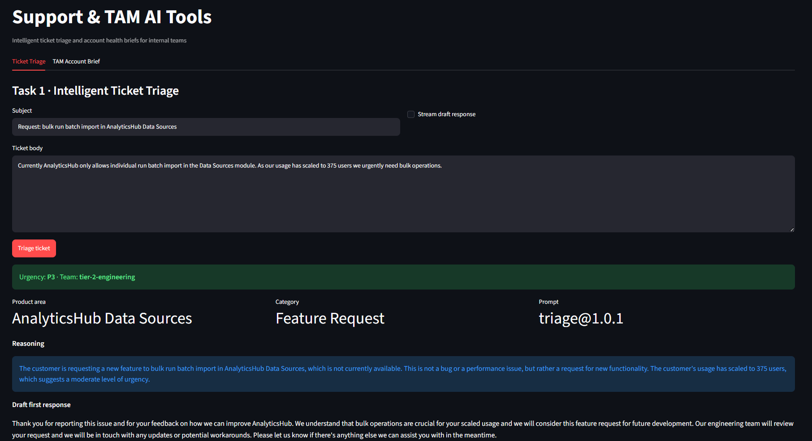
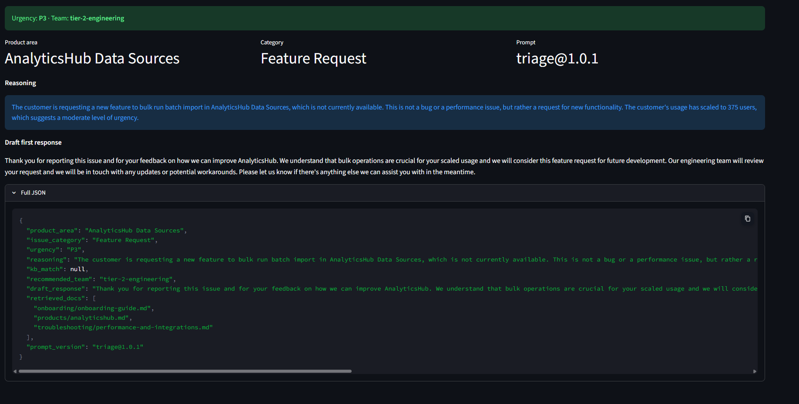
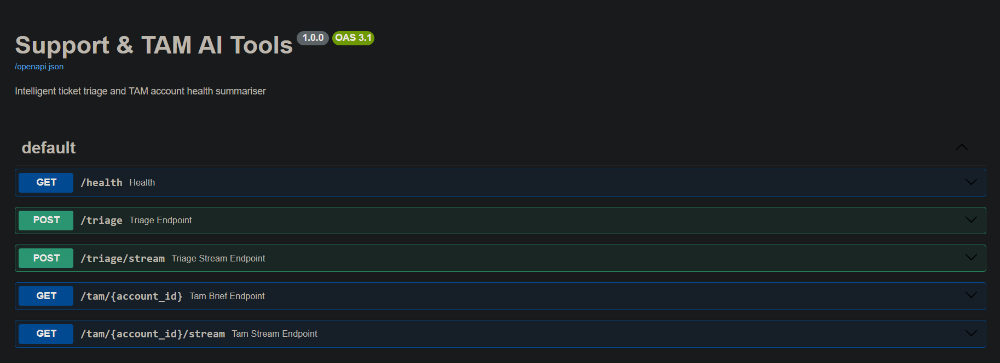
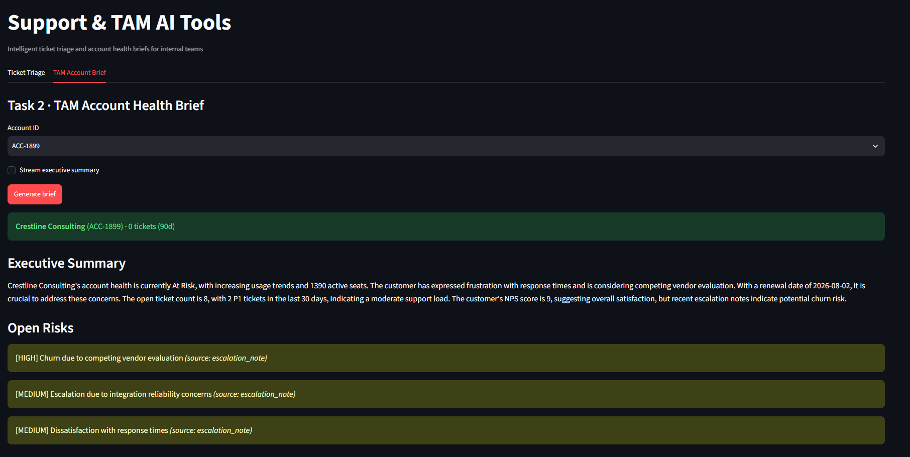
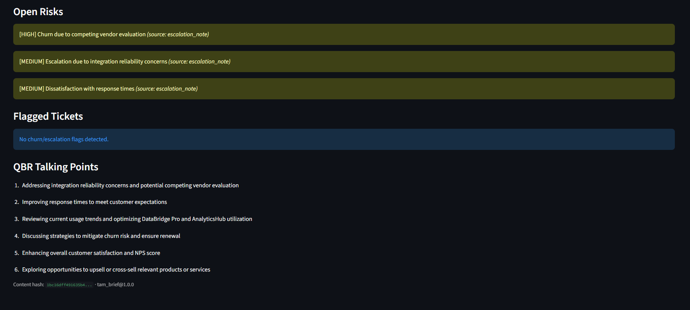
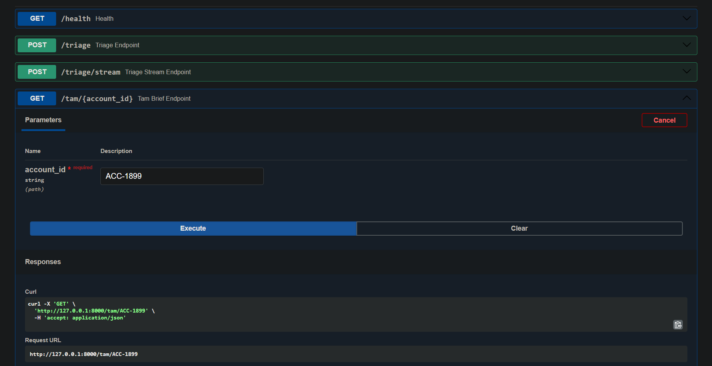
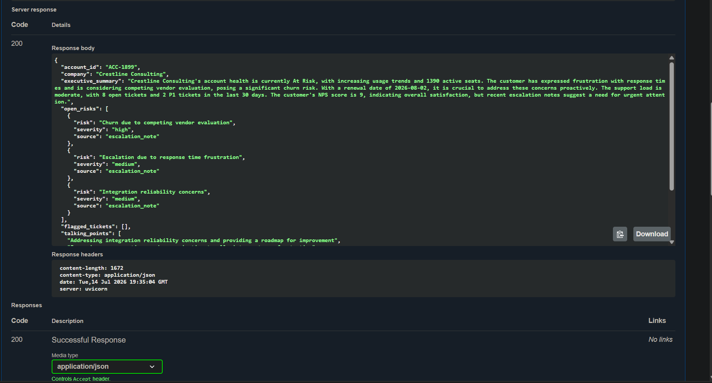
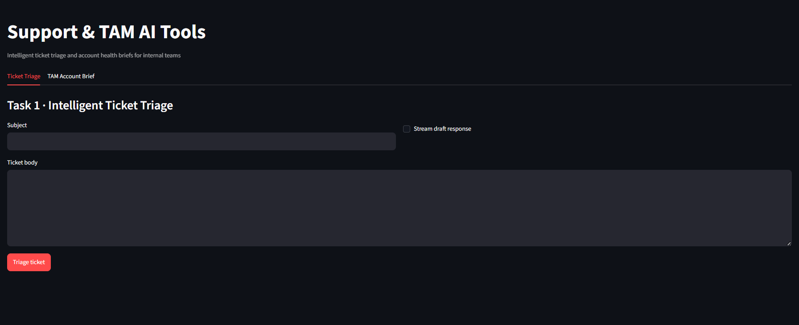

# Support & TAM AI Tools

Production-grade AI tooling for **Technical Support** (ticket triage) and **Technical Account Management** (account health briefs). Built for the US Delivery Internship technical task round using the provided mock dataset exclusively.

## 🎥 Walkthrough Video

A detailed video walkthrough of the codebase, a live demo of both Task 1 (triage) and Task 2 (TAM health briefs), and task evaluations is included below:

[**▶️ Play Video Walkthrough (photos/intern_task_walkthrough.mp4)**](photos/intern_task_walkthrough.mp4)

## Quick Start

```bash
# 1. Clone and install
pip install -r requirements.txt

# 2. Configure Groq API key
cp .env.example .env
# Edit .env and set GROQ_API_KEY for the default backend

# 3. Run any task via the single entry point
python main.py triage --subject "Pipeline down" --body "ERR_CONNECTION_TIMEOUT..."
python main.py tam --account-id ACC-3336
python main.py eval              # full eval (requires Groq API key)
python main.py eval --offline    # structural checks only (CI-safe)
python main.py serve             # FastAPI on http://127.0.0.1:8000
python main.py ui                # Streamlit demo for TAMs
```

## Repository Structure

```
├── main.py                 # Single entry point (required)
├── src/
│   ├── triage/             # Task 1 — ticket triage agent
│   ├── tam/                # Task 2 — account health summariser
│   ├── eval/               # Task 3 — evaluation harness
│   ├── rag/                # BM25 knowledge-base retrieval
│   ├── llm/                # Groq-backed client
│   ├── prompts/            # Versioned prompts + changelog
│   └── api/                # FastAPI REST endpoints
├── ui/app.py               # Streamlit demo (bonus)
├── data/                   # Mock tickets & accounts
├── knowledge-base/         # Product docs for RAG
├── eval_report.json        # Generated by eval harness
└── PROMPTS.md              # Prompt version changelog
```


## Task 1 · Intelligent Ticket Triage

**Callable function:** `src.triage.agent.triage_ticket()`  
**REST endpoint:** `POST /triage`

### Sample run

```bash
python main.py triage \
  --subject "URGENT: DataBridge Connectors pipeline down" \
  --body "Error: ERR_CONNECTION_TIMEOUT after 30s. 47 users affected in production."
```

### Output fields

| Field | Description |
|-------|-------------|
| `product_area` | Product and module (e.g. DataBridge Pro / Connectors) |
| `issue_category` | Bug, Performance, Billing, etc. |
| `urgency` | P1–P4 with reasoning |
| `kb_match` | Matched knowledge-base doc if a known pattern is found |
| `recommended_team` | tier-1-support, tier-2-engineering, integrations-team, etc. |
| `draft_response` | Ready-to-send first response for the agent |


Below is a screenshot of the Streamlit user interface demonstrating the Task 1 ticket triage in action. In this example, the user submits a feature request for AnalyticsHub Data Sources regarding bulk run batch import. The AI classifies it as a Feature Request under P3 urgency, routing it to the `tier-2-engineering` team, providing detailed reasoning, and drafting a polite first response thanking the customer.



The interface also displays the raw structured JSON payload output by the LLM, containing all schema fields (including product area, category, urgency, reasoning, KB match status, recommended team, draft response, and prompt version reference).



### API

```bash
python main.py serve
curl -X POST http://127.0.0.1:8000/triage \
  -H "Content-Type: application/json" \
  -d '{"subject": "SSO login failing", "body": "SAML_ASSERTION_EXPIRED for new users"}'
```

Streaming draft response: `POST /triage/stream` (SSE)


Below is the Swagger UI (OpenAPI 3.1 specification docs) generated automatically by FastAPI, showing the five endpoints exposed by the service for health checks, ticket triage (standard and SSE streaming), and TAM brief generation (standard and SSE streaming).



## Task 2 · TAM Account Health Summariser

**Callable function:** `src.tam.summarizer.generate_tam_brief()`  
**REST endpoint:** `GET /tam/{account_id}`

### Sample run

```bash
python main.py tam --account-id ACC-2944
```

Produces a 3-section brief:
1. **Executive summary** (3–5 sentences)
2. **Open risks & flagged issues** (with direct ticket quotes for churn/escalation signals)
3. **Recommended QBR talking points**

Determinism: `temperature=0`, fixed `seed`, and a `content_hash` for verification.

Streaming executive summary: `GET /tam/{account_id}/stream`
Below is a screenshot of the TAM Account Health Brief UI in Streamlit. For account ID `ACC-1899` (Crestline Consulting), the summarizer retrieves the account data, notes, and zero tickets in the last 90 days. It then drafts a concise executive summary and highlights categorized open risks (high-severity churn risk due to vendor evaluation and medium-severity escalations).



The lower section of the TAM Brief UI displays flagged tickets (if any) and a numbered checklist of recommended QBR discussion points customized for the client's current situation (e.g. addressing integration reliability and response times).



The interactive API docs allow teams to test endpoints directly. Here, the `GET /tam/{account_id}` endpoint is being invoked with `ACC-1899` as the path parameter.



The API successfully returns the structured `TAMBriefOutput` JSON payload for the account, including the executive summary, categorized open risks, and recommended talking points.




## Task 3 · Evaluation Harness

```bash
python main.py eval           # 12 test cases (6 triage + 6 TAM, incl. adversarial)
python main.py eval --offline # 4 structural checks, no API key needed
```

Reports: `eval_report.json` and `eval_report.md`

Each test case has rule-based acceptance criteria (field presence, enum values, quote validation). Pass threshold: combined score ≥ 0.75 with rule score ≥ 0.6.

**Adversarial cases:**
- `triage_adversarial_ambiguous` — vague mixed billing/performance ticket
- `tam_adversarial_missing_account` — account ID not in `accounts.json`


## Task 4 · Design Note

### Failure modes

**1. Misclassification of urgency (P1 inflation or deflation)**  
In production, an LLM might over-index on words like "urgent" and assign P1 to moderate issues, flooding tier-2 engineering—or under-classify a true outage as P3. *Detection:* track P1 rate vs. historical baseline, measure reopen/escalation rate within 4 hours, and sample weekly human audits on P1/P2 tickets. *Mitigation:* add a rule-based guardrail layer (e.g. "business stopped + no workaround + N users" heuristics) that can cap or bump urgency; require human confirmation for P1 auto-routing.

**2. Hallucinated KB matches or draft responses**  
RAG may retrieve a tangentially related doc, and the LLM may cite it as authoritative or invent troubleshooting steps not in the corpus. *Detection:* eval harness regression tests, automated check that cited `doc_path` exists and quoted error codes appear in retrieved chunks, and agent feedback thumbs-down. *Mitigation:* constrain responses to retrieved context only; include "if unsure, escalate" in the system prompt; surface retrieved excerpts in the UI for agent verification before send.

**3. Stale or incomplete account context for TAM briefs**  
Missing account records (intentionally present in the dataset), tickets older than 90 days with ongoing issues, or escalation notes not synced could produce an overly optimistic brief. *Detection:* monitor `ticket_count_90d` and flag briefs where account lookup fails; TAM feedback loop after QBRs. *Mitigation:* explicit "data gaps" section in output when account is missing; extend lookback configurable per account tier; integrate CRM/usage APIs in production (out of scope for mock data).

### Latency vs quality

The main trade-off is **BM25 retrieval + single LLM call with full ticket history** versus faster/cheaper approaches. For TAM briefs, I pass all 90-day tickets (compact JSON) in one prompt rather than a multi-step summarisation chain. This improves coherence and cross-ticket pattern detection but increases tokens and latency (~2–4s on llama-3.3-70b-versatile). If latency were the hard constraint, I would: (1) pre-summarise tickets into rolling 7-day digests stored at ingest time, (2) retrieve only P1/P2 and open tickets plus account metadata, and (3) use a smaller model for triage with escalation to a larger model only when confidence is low.

### Data sensitivity

Ticket and account data may contain PII (contact names, company details). This design: (1) sends data only to the configured Groq API with enterprise-grade DPA in production, never logging full ticket bodies to stdout in production mode, (2) keeps all retrieval local—BM25 over on-prem markdown with no external embedding calls, (3) uses `.env` for secrets with `.env.example` only, and (4) would add field-level redaction (emails, phone numbers) before LLM calls in production. For the mock dataset, content is synthetic, but the same pipeline supports a redaction preprocessor.

### Scaling at 10× ticket volume

At ~5,000 tickets/day, **the first bottleneck is synchronous LLM triage latency and cost**, not the Python pipeline itself. BM25 indexing is in-memory and rebuilds in <1s for the current KB; ticket JSON loading would move to a database with indexed `account_id` and `created_at`. The eval harness would shift to sampled nightly runs plus pre-merge offline checks. TAM brief generation should be **batch/async** (queue per account before QBR season) rather than on-demand for all 500 accounts. Horizontal scaling: stateless FastAPI workers behind a load balancer; Redis cache for triage results keyed by ticket content hash (dedupe repeat submissions).


## Bonus Features

| Feature | Location |
|---------|----------|
| Streamlit UI | `python main.py ui` |
| Streaming output | `/triage/stream`, `/tam/{id}/stream`, UI toggles |
| CI eval on commit | `.github/workflows/eval.yml` |
| Prompt versioning | `src/prompts/registry.py`, `PROMPTS.md` |


Below is the clean, high-performance Streamlit dashboard. It features sidebar links and quick-start tips, and divides the triage interface and TAM account summary engine into two easy-to-use tabbed views for support tier agents and TAMs.



## Environment Variables

See `.env.example`:

| Variable | Required | Description |
|----------|----------|-------------|
| `GROQ_API_KEY` | Yes for live runs | Groq API key |
| `GROQ_MODEL` | No | Default: `llama-3.3-70b-versatile` |
| `GROQ_SEED` | No | Default: `42` |
| `EVAL_OFFLINE_MODE` | No | Skip LLM in eval |
